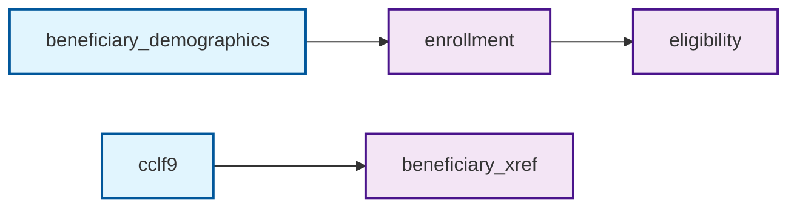

# Data Lineage Documentation
*Generated on 2026-04-09 03:00:32*

## Overview
This document provides a comprehensive view of data lineage and dependencies in the ACO Harmony data processing pipeline.

## Statistics
- **Total schemas**: 95
- **Raw sources**: 92
- **Processed/Derived**: 3
- **Reports/Analytics**: 0
- **Most complex schema**: eligibility (3 dependencies)

### Critical Schemas (High Downstream Impact)

## Data Flow Tree

### Raw Data Files (from CMS)
```
📁 alr
📁 bar
📁 cclf0
📁 cclf1
📁 cclf2
📁 cclf3
📁 cclf4
📁 cclf5
📁 cclf6
📁 cclf7
📁 cclf8
📁 cclf9
   └── beneficiary_xref
📁 cclf_management_report
📁 cclfa
📁 cclfb
📁 palmr
📁 pbvar
📁 sva
📁 tparc
```

### Reference Data
```
📚 aco_alignment
📚 aco_financial_guarantee_amount
📚 alternative_payment_arrangement_report
📚 annual_beneficiary_level_quality_report
📚 annual_quality_report
📚 beneficiary_data_sharing_exclusion_file
📚 beneficiary_demographics
   └── enrollment
📚 beneficiary_hedr_transparency_files
📚 blqqr_acr
📚 blqqr_dah
📚 blqqr_exclusions
📚 blqqr_uamcc
📚 bnex
📚 census
📚 cms_geo_zips
📚 cms_inquiry
📚 consolidated_alignment
📚 email_unsubscribes
📚 emails
📚 engagement
📚 enterprise_crosswalk
📚 estimated_cisep_change_threshold_report
📚 ffs_first_dates
📚 gaf_inputs
📚 gcm
📚 gpci_inputs
📚 hcmpi_master
📚 hdai_reach
📚 last_ffs_service
📚 mailed
📚 mbi_crosswalk
📚 mexpr
📚 needs_signature
📚 office_zip
📚 participant_list
📚 pe_inputs_equipment
📚 pe_inputs_labor
📚 pe_inputs_supplies
📚 pe_summary
📚 pecos_terminations_monthly_report
📚 pfs_rates
📚 plaru
📚 pprvu_inputs
📚 preliminary_alignment_estimate
📚 preliminary_alternative_payment_arrangement_report_156
📚 preliminary_benchmark_report_for_dc
📚 preliminary_benchmark_report_unredacted
📚 prospective_plus_opportunity_report
📚 provider_list
📚 pyred
📚 quarterly_beneficiary_level_quality_report
📚 quarterly_quality_report
📚 rap
📚 reach_bnmr
📚 recon
📚 rel_patient_program
📚 risk_adjustment_data
📚 salesforce_account
📚 sbmdm
📚 sbmepi
📚 sbmhh
📚 sbmhs
📚 sbmip
📚 sbmopl
📚 sbmpb
📚 sbmsn
📚 sbnabp
📚 sbqr
📚 shadow_bundle_reach
📚 sva_submissions
📚 voluntary_alignment
📚 vwyearmo_engagement
📚 zip_to_county
```

## Key Schema Dependencies

### consolidated_alignment

### enrollment

**Depends on:**
- beneficiary_demographics

**Used by:**
- eligibility

### eligibility

**Depends on:**
- beneficiary_demographics
- enrollment
- int_enrollment
- medical_claim

## Lineage Visualization


